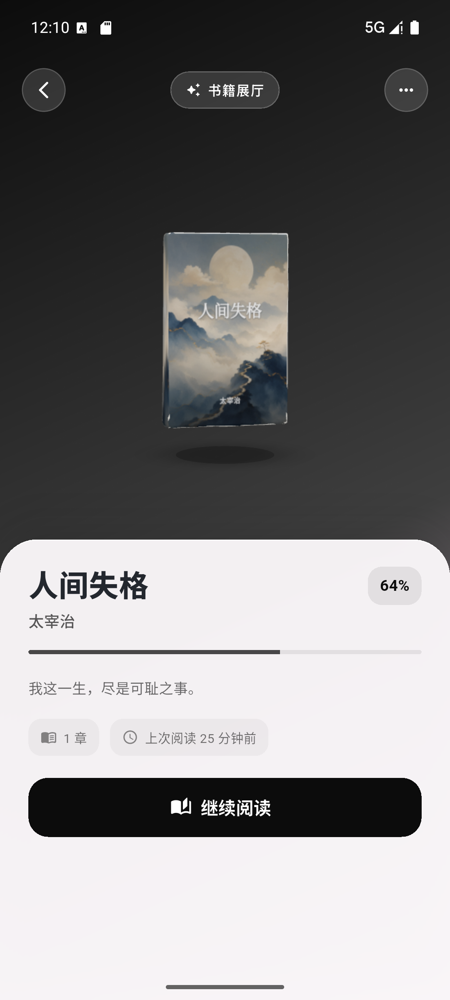
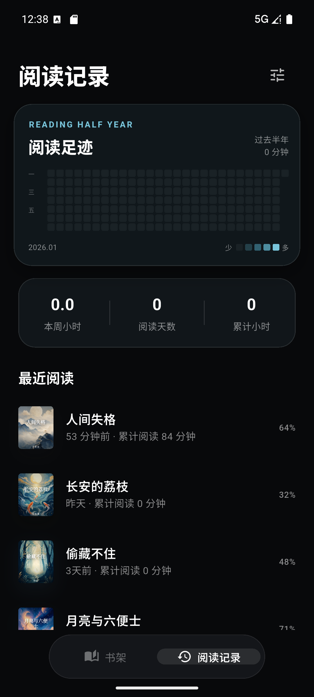

# 拾页 Shiye

> 一款本地优先的 Flutter 阅读器，记录每一次翻页与停留。

拾页提供沉浸式阅读、立体书架和本地书籍导入体验。当前版本专注 Android 平台。

[下载最新 Android APK](https://github.com/LYF-023015/shiye-reader/releases/latest)

## v1.5.1 · 修复连续阅读卡死

- 修复 v1.5.0 进入书籍展厅后点「继续阅读」卡死的问题：上下滚动改为懒加载，只渲染当前可见的章节，打开大书不再一次性排版全书正文导致界面卡死。
- 修复连续滚动模式下点击空白处无法唤出阅读浮层的问题（改为按章独立可选，避免选区层拦截点击）。

## v1.5.0 · 连续阅读与朗读体验

- 上下滚动改为连续无缝滚动：所有章节在同一视图衔接，向下滑即进入下一章，进度、书签和批注随滚动实时更新。
- 朗读改为连续朗读：读完本章自动接下一章直至全书，朗读时画面自动跟随到正在朗读的章节。
- 阅读章节标题加粗放大，作为标题更醒目。
- 选中文字后阅读浮层保持可见，批注入口不再被自动隐藏遮挡。
- 书籍展厅进度条下方显示当前阅读到的章节，而非书的开头。
- 书籍展厅「收藏第一章」增加明确反馈提示，说明书签可在阅读界面的目录中查看。
- 浮光书架只有两本书时不再循环出现重复卡片，改为两本有界切换；三本及以上保持循环。
- 朗读可靠启动：长文本分段朗读，修复点击「朗读本章」无反应的问题。

## v1.3.0 · 阅读内核与存储更新

- 书架封面统一叠加行书风格书名，覆盖预设封面和 EPUB 内嵌封面。
- EPUB 解析移至后台 isolate，减少导入时界面卡顿。
- TXT 新增序章、楔子、前言、后记、番外、卷名和英文 Chapter/Part/Volume 章节识别。
- 批注保存章节内位置，支持点击跳转、编辑、删除和导出 Markdown。
- 支持完整备份与恢复，包含书籍、阅读位置、书签、批注、阅读记录和阅读设置。
- Android 文件读取、备份导入和导出改在后台线程执行；应用进入后台时立即保存阅读数据。
- EPUB 改用 epub.js WebView 阅读内核，支持原书 CSS、嵌入字体、CFI 进度、全文搜索、目录和 CFI 高亮批注，并尝试呈现固定版式。
- PDF 改用纯 Dart 阅读编辑内核，支持缩放、文本搜索、选区、目录、批注侧栏、保存和另存。
- 阅读位置、书签和批注增加字符锚点，并提供全局批注中心、Markdown/JSON 导出和系统分享。
- 书架支持 CoverFlow、网格和列表，增加元数据编辑、筛选排序、批量删除与批量备份。
- 完整备份升级为带 SHA-256 资源校验的 ZIP，支持预览、整体替换和合并恢复。
- 封面与 PDF 原文件从主 JSON 分离，超过 8 MB 的封面可可靠持久化。
- Android 文件操作迁移到 Activity Result API，支持更新检查、本地错误日志和反馈入口。
- 章节正文迁移到 SQLite；schema 5 JSON 只保存轻量元数据和阅读状态，进度更新不再序列化正文与 HTML。
- 全局批注入口并入阅读记录页，底部主导航精简为书架、阅读记录和数据菜单。
- 移除未实现的“仿真翻页”选项，保留可选择文字的左右分页与上下滚动。

## v1.1.0 · P0 可用性更新

- 阅读数据迁移到 Android 应用私有支持目录，避免临时目录被系统清理。
- 数据写入增加临时文件原子替换、备份恢复、旧版数据迁移和错误提示。
- 精确保存章节及章节内阅读位置，重启后恢复到上次阅读位置附近。
- 导入时增加进度遮罩、文件异常提示和重复书籍处理。
- 重复书籍可选择替换、保留两本或取消。
- 支持删除书籍，并同步清理阅读进度、书签、批注和阅读记录。
- 书架新增最近阅读、最近导入和书名排序。
- 暂时移除不可完整阅读的 PDF 导入入口，当前明确支持 TXT 和无 DRM EPUB。

## 界面预览






## 功能

- 书架：CoverFlow、网格和列表浏览，支持搜索、筛选、排序、批量管理、元数据及封面编辑。
- 书籍展厅：可交互的 3D 书籍模型和书籍详情。
- 本地导入：支持 TXT、无 DRM EPUB 和 PDF；TXT 包含 UTF-8、UTF-16、GBK 解码。
- 阅读器：富内容 EPUB、PDF、导航目录、搜索、分页/滚动、进度定位、精确书签批注、自动滚动及 TTS。
- 阅读记录：按日期与阅读时长生成统计与热力图。
- 本地存储：章节正文保存在 SQLite，书架元数据和阅读状态保存在应用私有目录，支持 ZIP 备份恢复。

## 技术栈

- Flutter / Dart
- Material UI
- `archive`、`charset`、`xml`：本地书籍解析
- `sqflite`：章节正文数据库
- `flutter_epub_viewer`：EPUB WebView、CFI、目录、搜索和高亮
- `dart_pdf_editor`：PDF 搜索、目录、选区和批注
- `interactive_3d`：书籍 3D 展示
- Android Kotlin `MethodChannel`：本地文件选择

## 运行

```bash
flutter pub get
flutter run
```

## 项目结构

```text
lib/
├── models/       # Book、Chapter 等领域模型
├── screens/      # 书架、记录、展厅与阅读界面
├── services/     # 导入、持久化、封面调色等服务
├── theme/        # 全局主题
└── widgets/      # 可复用 UI 组件
```

## 当前限制

- 不支持 DRM 与加密 EPUB；固定版式由 epub.js 尝试呈现，复杂跨页版式仍可能存在兼容差异。
- 扫描型 PDF 没有文本层时无法直接搜索，需要先进行 OCR。
- 为保证文字选择和 WebView 交互，未提供会把页面栅格化的卷页动画。
- 云账号与多设备同步尚未启用；当前使用 ZIP 备份进行设备间迁移。

## 路线图

- [x] 将章节正文迁移到 SQLite。
- [x] 增加 PDF 文本层搜索、批注和目录支持。
- [x] 增加 EPUB CFI、WebView CSS 与嵌入字体支持。
- [ ] 完成更多低端 Android 真机与大型书库性能验证。
